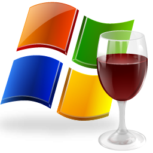

# Wine in a Container 

Wine (originally an acronym for "Wine Is Not an Emulator") is a compatibility layer capable of running Windows applications on several POSIX-compliant operating systems, such as Linux, macOS, & BSD. Instead of simulating internal Windows logic like a virtual machine or emulator, Wine translates Windows API calls into POSIX calls on-the-fly, eliminating the performance and memory penalties of other methods and allowing you to cleanly integrate Windows applications into your desktop.

# Usage

This image isn't intended to be used only to run Wine, but also, as a base image to be used in a `FROM` statement where you add your aditional software to it. Create a shell script to start your desired application and add to the container `COPY yourScript /app.sh`, it will run when the environment initialize

Once you run your image, just connect to it using a VNC client and type the password defined in the `VNC_PASSWORD` variable.

# Variables

  * `VNC_PASSWORD` - Password for the VNC connection
